## HW2

Создание индекса

```
CREATE index user_name_lname_idx ON hlarch.user (name text_pattern_ops, last_name text_pattern_ops);
```

### Без индекса

План запроса

```
Sort  (cost=17516.51..17516.51 rows=2 width=552) (actual time=95.764..95.765 rows=6 loops=1)
Sort Key: id
Sort Method: quicksort  Memory: 25kB
->  Seq Scan on "user"  (cost=0.00..17516.50 rows=2 width=552) (actual time=0.049..95.726 rows=6 loops=1)
Filter: (((name)::text ~~ 'Роб%'::text) AND ((last_name)::text ~~ 'Абр%'::text))
Rows Removed by Filter: 999925
Planning Time: 0.226 ms
Execution Time: 95.805 ms
```

**Aggregate report**

| Request number | Response Time, ms | Throughput |
|----------------|-------------------|------------|
| 1              | 42                | 23.8       |
| 10             | 43                | 10.5       |
| 100            | 293               | 69.4       |
| 1000           | 5728              | 56.5       |

**1**
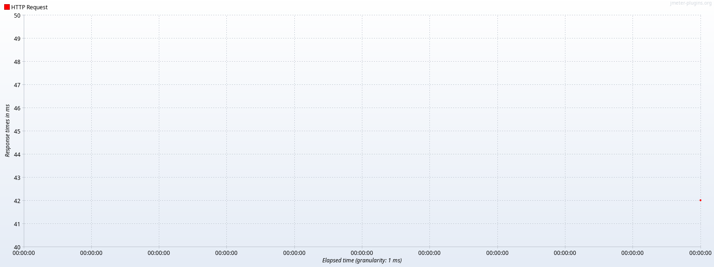
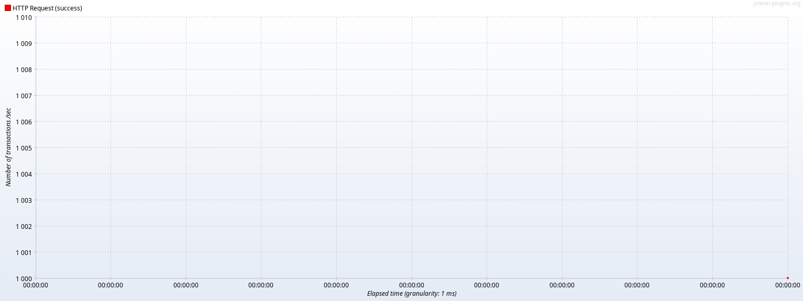

**10**
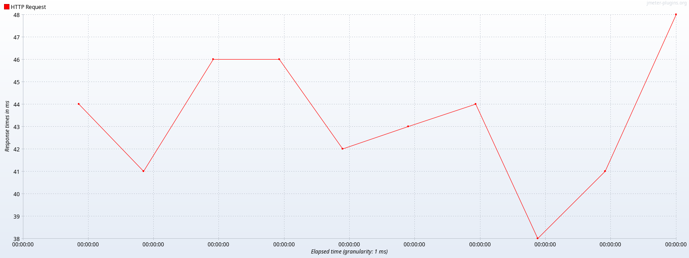
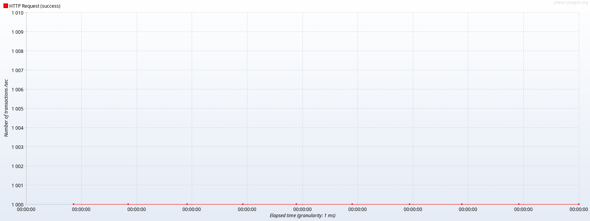

**100**
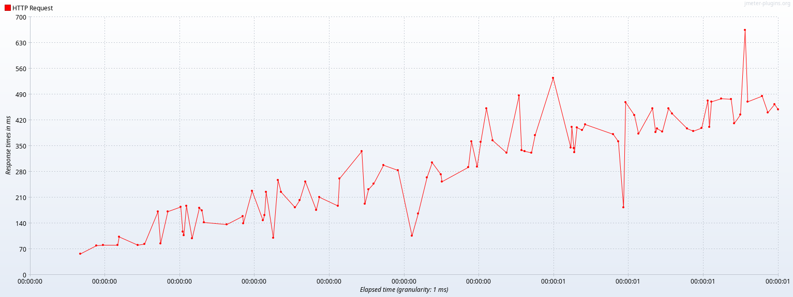
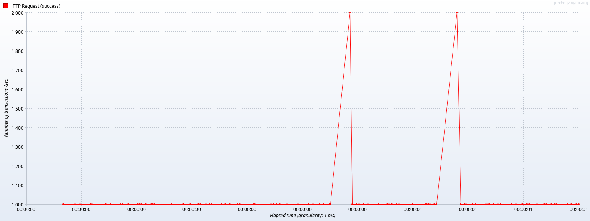

**1000**
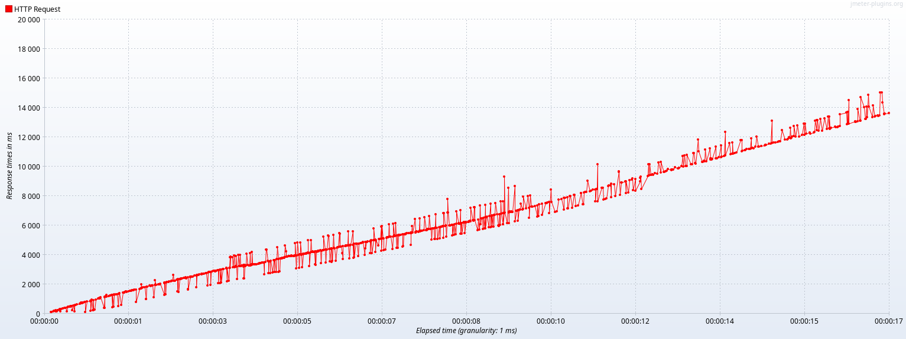
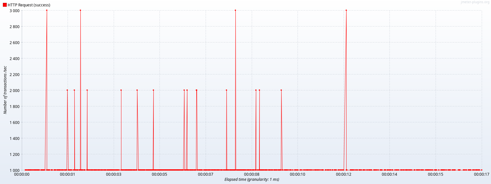

### C индексом

План запроса

```
Sort  (cost=87.95..87.95 rows=1 width=33) (actual time=0.349..0.350 rows=6 loops=1)
Sort Key: id
Sort Method: quicksort  Memory: 25kB
->  Index Scan using usindex on "user"  (cost=0.42..87.94 rows=1 width=33) (actual time=0.066..0.338 rows=6 loops=1)
Index Cond: (((name)::text ~>=~ 'Роб'::text) AND ((name)::text ~<~ 'Ров'::text) AND ((last_name)::text ~>=~ 'Абр'::text) AND ((last_name)::text ~<~ 'Абс'::text))
Filter: (((name)::text ~~ 'Роб%'::text) AND ((last_name)::text ~~ 'Абр%'::text))
Planning Time: 0.695 ms
Execution Time: 0.383 ms
```

**Aggregate report**

| Request number | Response Time, ms | Throughput |
|----------------|-------------------|------------|
| 1              | 130               | 7.7        |
| 10             | 7                 | 11         |
| 100            | 4                 | 100.5      |
| 1000           | 60                | 365.1      |

**1**
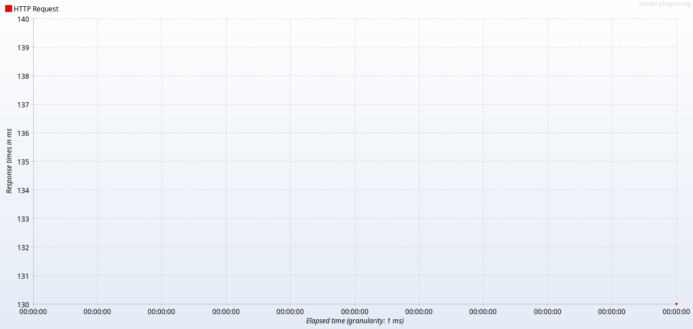
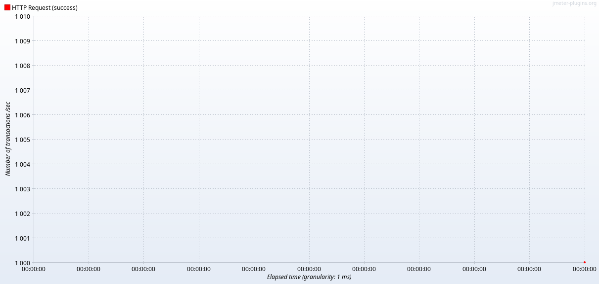

**10**
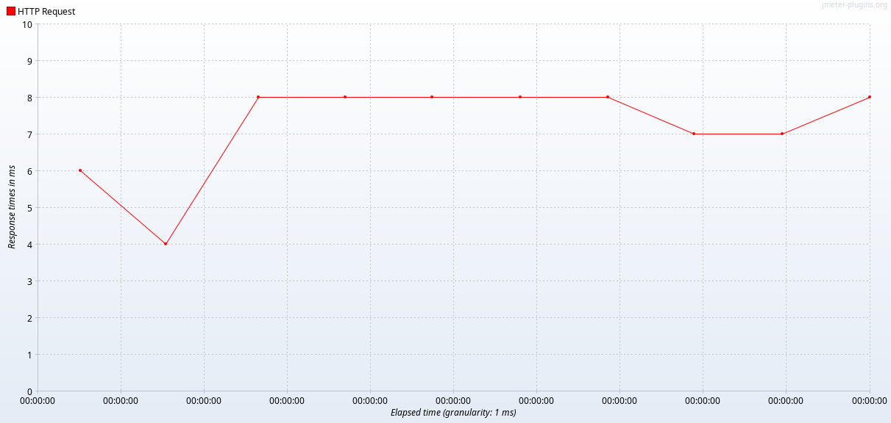


**100**
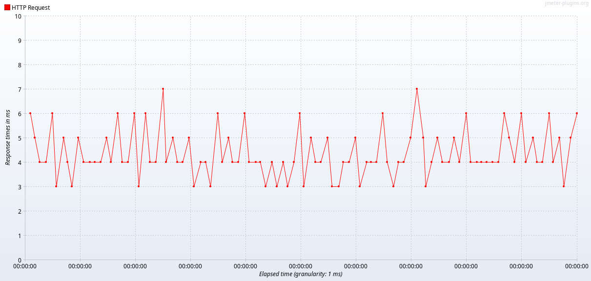
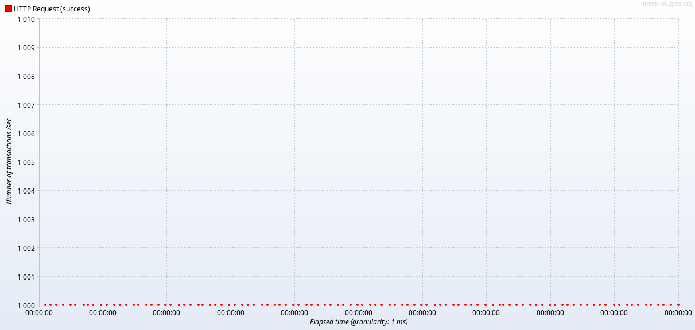

**1000**
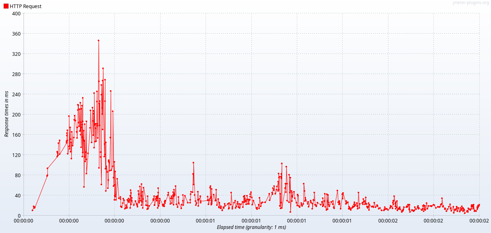
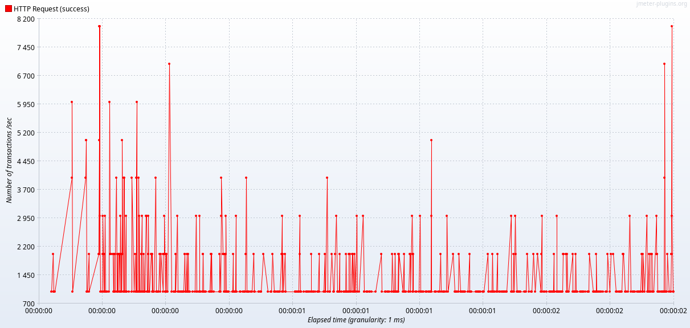

### Почему именно такой индекс

Используется btree индекс, т.к. нужен поиск по префиксному шаблону (text_pattern_ops).
Т.к. поиск идет одновременно по двум столбцам (name, last_name) индекс создается составной, чтобы были помещены в индекс
оба поля.